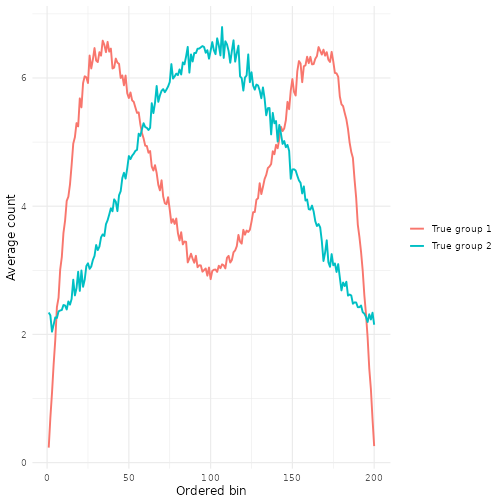
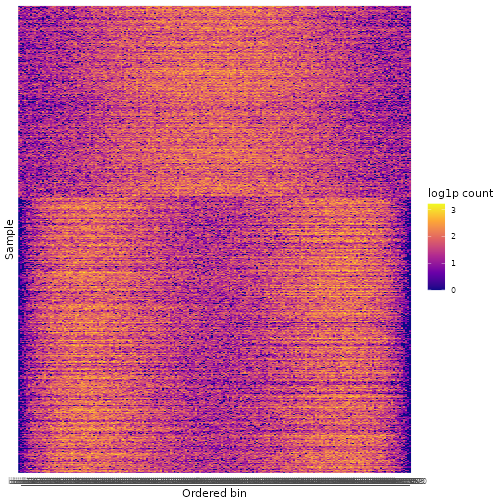
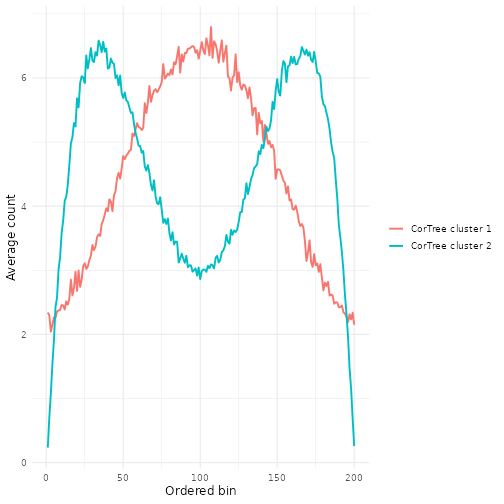
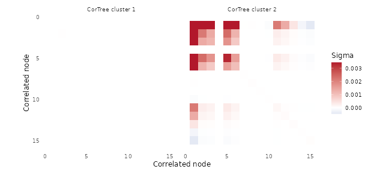
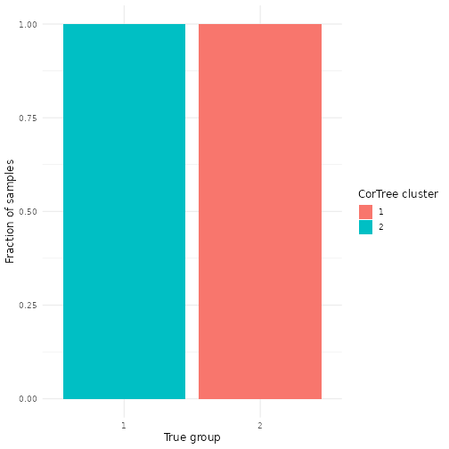

# CorTree

CorTree is an R package for Bayesian mixture modeling of count data with tree-structured dependence. It is built around MCMC samplers implemented in C++ through Rcpp/RcppArmadillo, with R helpers for simulations, phylogenetic microbiome analyses, DNase footprinting analyses, diagnostics, and plotting.

The main idea is to represent high-dimensional counts through binary tree splits. CorTree can model correlation among the upper tree nodes within mixture components, while an independent-tree variant is available by setting `all_ind = TRUE`. The package also includes a phylogenetic-tree sampler for count tables whose features are tips in an `ape::phylo` tree.

## What Is In This Repository

```text
R/      R wrappers and helper functions
src/    Rcpp/RcppArmadillo sampler implementations
inst/   C++ headers exposed for package builds
data/   small project data files used by the AGP workflows
test/   simulation scripts and simulation result summaries
RDA/    research analysis scripts for AGP and DNase workflows
```

Important files:

- `R/RcppExports.R`: R entry points for the compiled samplers.
- `R/cortree_randominit.R`: multi-start CorTree fitting.
- `R/cortree_heldout.R`: held-out likelihood based model/start selection.
- `R/construct_tree.R`: dyadic tree sufficient statistics for rectangular count matrices.
- `R/AGP_help.R`, `R/DCC_help.R`, `R/microbiome_help.R`: analysis, plotting, and evaluation helpers.
- `src/CorTree.cpp`: dyadic-tree CorTree sampler.
- `src/PhyloTree.cpp`: phylogenetic-tree aggregation and sampler.
- `src/CorTreePredict.cpp`: held-out predictive likelihood and membership utilities.

## Installation

Install from GitHub with `devtools`:

```r
install.packages("devtools")
devtools::install_github("yuliangxu/CorTree", ref = "biom_revision1")
```

For development inside a cloned copy:

```r
devtools::load_all()
```

The core package imports `Rcpp` and links to `RcppArmadillo`. You will need a working C++ compiler suitable for building R packages.

Some analysis scripts use additional packages, including:

```r
install.packages(c(
  "ape", "cluster", "data.table", "dplyr", "ggplot2", "gridExtra",
  "mclust", "patchwork", "pheatmap", "reshape2", "scales", "tidyr",
  "uwot", "viridis"
))

install.packages("BiocManager")
BiocManager::install(c("DirichletMultinomial", "phyloseq"))
```

The DNase comparison scripts also use `CENTIPEDE`, which may need to be installed separately depending on your R setup.

## Small Simulation Example

This example is a small, README-friendly version of `test/Sim1_clus_cortree.R`. We simulate two groups of samples from different beta-mixture densities, bin each sample into a count vector, and compare K-means with a short CorTree run.


``` r
devtools::load_all(quiet = TRUE)

n_sample <- 1000L
n_leaf <- 200L
n_clus <- 2L
tree_depth <- 6L

Z_true <- sample(seq_len(n_clus), n_sample, prob = c(0.6, 0.4), replace = TRUE)
X <- matrix(0L, nrow = n_sample, ncol = n_leaf)

gen_X <- function(n, z) {
  weight <- rbeta(1, 10, 10)
  n1 <- floor(n * weight)
  n2 <- n - n1
  switch(
    z,
    c(rbeta(n1, 2, 6), rbeta(n2, 6, 2)),
    c(rbeta(n1, 1, 1), rbeta(n2, 3, 3))
  )
}

hist_breaks <- seq(0, 1, length.out = n_leaf + 1L)
for (i in seq_len(n_sample)) {
  draws <- gen_X(sample(600:1200, 1), Z_true[i])
  X[i, ] <- hist(draws, breaks = hist_breaks, plot = FALSE)$counts
}

rownames(X) <- paste0("sample_", seq_len(nrow(X)))
colnames(X) <- paste0("bin_", seq_len(ncol(X)))
dim(X)
#> [1] 1000  200
```

``` r
table(Z_true)
#> Z_true
#>   1   2 
#> 590 410
```

The simulated count matrix has samples in rows and ordered bins in columns. The two groups have visibly different average profiles.


``` r
profile_df <- data.frame(
  bin = rep(seq_len(n_leaf), times = n_clus),
  mean_count = unlist(lapply(seq_len(n_clus), function(k) colMeans(X[Z_true == k, , drop = FALSE]))),
  group = factor(rep(paste("True group", seq_len(n_clus)), each = n_leaf))
)

ggplot2::ggplot(profile_df, ggplot2::aes(bin, mean_count, color = group)) +
  ggplot2::geom_line(linewidth = 0.9) +
  ggplot2::labs(x = "Ordered bin", y = "Average count", color = NULL) +
  ggplot2::theme_minimal(base_size = 12)
```



A heatmap of the same data, sorted by the true group, shows the tree-structured count signal that CorTree uses.


``` r
ord <- order(Z_true)
heat_df <- as.data.frame(as.table(log1p(X[ord, , drop = FALSE])))
names(heat_df) <- c("sample", "bin", "log_count")
heat_df$sample <- factor(heat_df$sample, levels = rownames(X)[ord])

ggplot2::ggplot(heat_df, ggplot2::aes(bin, sample, fill = log_count)) +
  ggplot2::geom_tile() +
  ggplot2::scale_fill_viridis_c(option = "C") +
  ggplot2::labs(x = "Ordered bin", y = "Sample", fill = "log1p count") +
  ggplot2::theme_minimal(base_size = 11) +
  ggplot2::theme(axis.text.y = ggplot2::element_blank())
```



Now fit K-means and CorTree. The CorTree run below is intentionally short so the README can be rendered quickly; for real analyses, use more iterations and multiple starts.


``` r
Z_kmeans <- kmeans(scale(X), centers = n_clus, nstart = 25)$cluster

row_rank <- rank(rowSums(X), ties.method = "first")
init_Z <- as.integer(cut(
  row_rank,
  breaks = quantile(row_rank, probs = seq(0, 1, length.out = n_clus + 1L)),
  include.lowest = TRUE,
  labels = FALSE
)) - 1L

invisible(capture.output({
  fit_cortree <- CorTree_sampler(
    X = X,
    init_Z = init_Z,
    n_clus = n_clus,
    tree_depth = tree_depth,
    cutoff_layer = 3L,
    total_iter = 80L,
    burnin = 50L,
    warm_start = 0L,
    c_sigma2_vec = 10,
    sigma_mu2 = 0.1,
    cov_interval = 5L,
    all_ind = FALSE
  )
}))

Z_cortree <- apply(fit_cortree$mcmc$Z, 1, function(z) {
  as.integer(names(which.max(table(z)))) + 1L
})

ari_table <- data.frame(
  Method = c("K-means", "CorTree"),
  ARI = c(
    mclust::adjustedRandIndex(Z_true, Z_kmeans),
    mclust::adjustedRandIndex(Z_true, Z_cortree)
  ),
  check.names = FALSE
)
ari_table
#>    Method ARI
#> 1 K-means   1
#> 2 CorTree   1
```


``` r
cortree_profile_df <- data.frame(
  bin = rep(seq_len(n_leaf), times = n_clus),
  mean_count = unlist(lapply(seq_len(n_clus), function(k) {
    colMeans(X[Z_cortree == k, , drop = FALSE])
  })),
  cluster = factor(rep(paste("CorTree cluster", seq_len(n_clus)), each = n_leaf))
)

ggplot2::ggplot(cortree_profile_df, ggplot2::aes(bin, mean_count, color = cluster)) +
  ggplot2::geom_line(linewidth = 0.9) +
  ggplot2::labs(x = "Ordered bin", y = "Average count", color = NULL) +
  ggplot2::theme_minimal(base_size = 12)
```



The fitted covariance matrices below summarize posterior dependence among the correlated upper-tree nodes. The sampler stores precision matrices, so this plot averages the post-burn-in precision draws for each cluster and then inverts them to show fitted `Sigma`. The heatmap scale is clipped at an upper quantile so that the smaller off-diagonal structure remains visible.


``` r
sigma_inv_draws <- fit_cortree$mcmc$Sigma_inv
sigma_list <- lapply(seq_len(n_clus), function(k) {
  precision_mean <- Reduce(
    `+`,
    lapply(sigma_inv_draws, function(draw) draw[, , k])
  ) / length(sigma_inv_draws)
  solve(precision_mean)
})

sigma_df <- do.call(rbind, lapply(seq_along(sigma_list), function(k) {
  mat <- sigma_list[[k]]
  out <- as.data.frame(as.table(mat))
  names(out) <- c("row", "col", "sigma")
  out$row <- as.integer(out$row)
  out$col <- as.integer(out$col)
  out$cluster <- paste("CorTree cluster", k)
  out
}))

sigma_limit <- as.numeric(stats::quantile(abs(sigma_df$sigma), 0.98, na.rm = TRUE))
sigma_df$sigma_clipped <- pmax(-sigma_limit, pmin(sigma_limit, sigma_df$sigma))

ggplot2::ggplot(sigma_df, ggplot2::aes(col, row, fill = sigma_clipped)) +
  ggplot2::geom_tile() +
  ggplot2::facet_wrap(~cluster, nrow = 1) +
  ggplot2::scale_y_reverse() +
  ggplot2::scale_fill_gradient2(
    low = "#2166AC",
    mid = "white",
    high = "#B2182B",
    midpoint = 0,
    name = "Sigma"
  ) +
  ggplot2::coord_equal() +
  ggplot2::labs(x = "Correlated node", y = "Correlated node") +
  ggplot2::theme_minimal(base_size = 12) +
  ggplot2::theme(panel.grid = ggplot2::element_blank())
```




``` r
compare_df <- data.frame(
  sample = seq_len(n_sample),
  true_group = factor(Z_true),
  cortree_cluster = factor(Z_cortree)
)

ggplot2::ggplot(compare_df, ggplot2::aes(true_group, fill = cortree_cluster)) +
  ggplot2::geom_bar(position = "fill") +
  ggplot2::labs(
    x = "True group",
    y = "Fraction of samples",
    fill = "CorTree cluster"
  ) +
  ggplot2::theme_minimal(base_size = 12)
```



## Quick Start: Dyadic CorTree

Use `CorTree_sampler()` when your data are an `n x p` count matrix, with samples in rows and ordered features/bins in columns.

```r
library(CorTree)

set.seed(1)
X <- matrix(rpois(60 * 64, lambda = 10), nrow = 60, ncol = 64)

n_clus <- 3L
init_Z <- sample.int(n_clus, nrow(X), replace = TRUE) - 1L

fit <- CorTree_sampler(
  X = X,
  init_Z = init_Z,
  n_clus = n_clus,
  tree_depth = 6L,
  cutoff_layer = 3L,
  total_iter = 150L,
  burnin = 100L,
  warm_start = 0L,
  c_sigma2_vec = 10,
  sigma_mu2 = 0.1,
  cov_interval = 3L,
  all_ind = FALSE
)

names(fit)
fit$elapsed
cluster_hat <- apply(fit$mcmc$Z, 1, function(z) {
  as.integer(names(which.max(table(z))))
})
table(cluster_hat)
```

Set `all_ind = TRUE` to fit the independent-tree comparison model with the same interface.

## Multi-Start Fitting

MCMC mixture models can be sensitive to initialization. `CorTree_sampler_randominit()` runs several starts and returns the start with the best post-burn-in log-likelihood.

```r
fit_multi <- CorTree_sampler_randominit(
  X = X,
  n_clus = 3L,
  tree_depth = 6L,
  cutoff_layer = 3L,
  total_iter = 150L,
  burnin = 100L,
  n_start = 5L,
  c_sigma2_vec = 10,
  sigma_mu2 = 0.1
)

fit_multi$best_start_id
best_fit <- fit_multi$best_fit
```

For train/test selection, use `CorTree_sampler_randominit_heldout()`. It fits on training samples, evaluates held-out log predictive density, and can refit the selected initialization on the full data.

## Phylogenetic Count Data

Use `PhyloTree_sampler()` when columns of the count matrix correspond to tips in an `ape::phylo` object.

```r
library(ape)
library(CorTree)

count_data <- matrix(rpois(40 * 20, lambda = 5), nrow = 40, ncol = 20)
tree <- rtree(20)
tree$tip.label <- paste0("taxon_", seq_len(20))
colnames(count_data) <- tree$tip.label

tree_info <- aggregate_tree_counts(count_data, tree)
tree_depth <- max(tree_info$depth)

n_clus <- 3L
init_Z <- sample.int(n_clus, nrow(count_data), replace = TRUE) - 1L

fit_phylo <- PhyloTree_sampler(
  count_data = count_data,
  tree = tree,
  init_Z = init_Z,
  n_clus = n_clus,
  cutoff_layer = min(3L, tree_depth),
  total_iter = 150L,
  burnin = 100L,
  warm_start = 0L,
  c_sigma2_vec = 3,
  sigma_mu2 = 0.5,
  cov_interval = 3L,
  all_ind = FALSE
)
```

## Simulation Workflow

The `test/` directory contains simulation scripts that compare:

- K-means
- PAM
- Dirichlet-multinomial mixture models
- independent-tree sampler
- CorTree sampler

Typical commands:

```r
Rscript test/Sim1_clus_cortree.R
Rscript test/Analyze1_sim1_results.R
```

The simulation scripts were written for batch/HPC use and may write outputs to a local scratch directory. Edit `out_path` or `out_dir` in the script before running on a new machine.

## American Gut Project Workflow

The AGP scripts in `RDA/` use the included data files under `data/`:

- `data/ag_fecal.txt`
- `data/ag_fecal_from_biom.txt`
- `data/97_otus.tree`
- `data/Cluster_AG_subsample.rds`

Suggested order:

```r
Rscript RDA/AGP0_Data_process.R
Rscript RDA/AGP1_cortree.R
Rscript RDA/AGP3_compare.R
Rscript RDA/AGP4_plots.R
```

`AGP1_cortree.R` fits the phylogenetic CorTree model. `AGP3_compare.R` compares CorTree against DMM and independent-tree fits. `AGP4_plots.R` builds UMAP, cluster, covariate, and method-comparison plots.

These scripts currently write results to `/cwork/yx306/CorTree`. Change `out_dir` near the top of each script if you are running elsewhere.

## DNase / Motif Workflows

The DNase scripts in `RDA/` analyze REST and NRF1 K562 DNase count matrices and compare CorTree to initialization baselines and methods such as K-means, PAM, DMM, independent tree, and CENTIPEDE.

Representative scripts:

- `RDA/REST_K_init_compare.R`
- `RDA/NRF1_K_init_compare.R`
- `RDA/REST_sensi.R`
- `RDA/NRF1_sensi.R`
- `RDA/DNase_sensi_analyis.R`

The scripts look for DNase input files using `resolve_data_dir()` in `R/DCC_help.R`. The easiest portable option is to set:

```r
Sys.setenv(CORTREE_DNA_DATA = "/path/to/DNA_data")
```

or set it before launching R:

```sh
export CORTREE_DNA_DATA=/path/to/DNA_data
```

Expected DNase files include names such as:

- `REST.K562.DNase.counts.mat.rds`
- `REST.K562.sites.chip.labels.tss.dist.rds`
- `NRF1.K562.DNase.counts.mat.rds`
- `NRF1.K562.sites.chip.labels.tss.dist.rds`

## Main Function Reference

Core samplers:

- `CorTree_sampler(X, n_clus, tree_depth, cutoff_layer, total_iter, burnin, init_Z, ...)`
  fits the correlated dyadic-tree mixture model.
- `PhyloTree_sampler(count_data, tree, n_clus, cutoff_layer, total_iter, burnin, init_Z, ...)`
  fits the correlated phylogenetic-tree mixture model.
- `CorTree_sampler_randominit(...)`
  runs multiple starts and selects a fit by post-burn-in log-likelihood.
- `CorTree_sampler_randominit_heldout(...)`
  selects a start by held-out log predictive density.

Prediction and utilities:

- `CorTree_heldout_logpred()`
  computes held-out log predictive density for dyadic-tree CorTree fits.
- `CorTree_heldout_membership()`
  estimates held-out cluster membership probabilities.
- `aggregate_tree_counts()`
  aggregates tip counts over a phylogenetic tree.
- `construct_tree()`
  builds dyadic split counts and empirical logits for rectangular count matrices.

Common arguments:

- `X` or `count_data`: count matrix with samples in rows.
- `n_clus`: number of mixture components.
- `init_Z`: integer vector of initial cluster labels in `0, ..., n_clus - 1`.
- `tree_depth`: dyadic tree depth for rectangular data.
- `cutoff_layer`: upper tree depth modeled with correlated node effects.
- `total_iter`, `burnin`: MCMC iteration controls.
- `all_ind`: set to `TRUE` for independent-tree comparison fits.
- `cov_interval`: frequency for covariance/correlation updates.

## Output Objects

Sampler outputs are lists with:

- `mcmc`: posterior draws and traces, including cluster assignments `Z`, mixture weights `pi`, log-likelihood, and parameter traces.
- `elapsed`: runtime in seconds.

Many workflow scripts save larger result bundles as `.rds` files that include input settings, fitted objects, hard cluster assignments, timing summaries, covariate association tables, and plot-ready data.

## Notes For Contributors

- The package is in active research/development form.
- `.slurm` files are intentionally ignored and kept local only.
- New files under `data/` and `out/` are ignored in `.gitignore` to avoid accidentally committing large or machine-specific outputs.
- Before committing package interface changes, regenerate Rcpp exports if needed:

```r
Rcpp::compileAttributes()
```

and then test that the package builds:

```r
devtools::load_all()
devtools::check()
```
