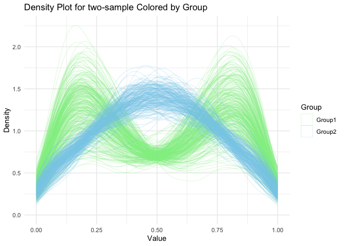
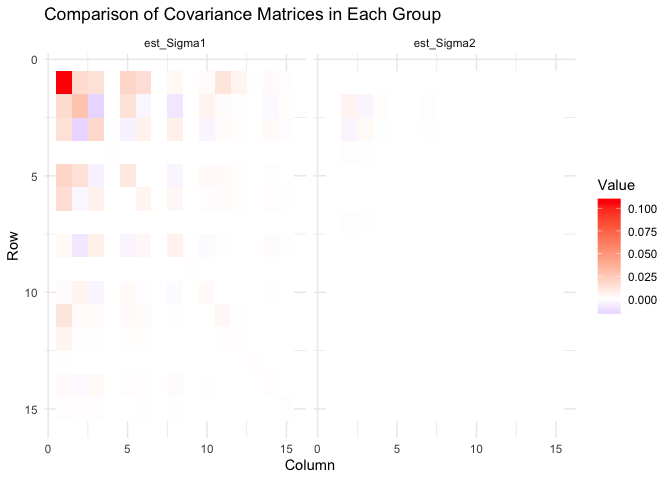

CorTree:Vignette
================
Yuliang Xu
2025-09-19

- [Installation](#installation)
- [Reproducible workflow](#reproducible-workflow)
- [Example](#example)
  - [Generate simulation data](#generate-simulation-data)
    - [Competing methods](#competing-methods)
    - [Run CorTree](#run-cortree)
    - [Summarize result](#summarize-result)
    - [(Optional) Visualizations](#optional-visualizations)

CorTree is an R package for “A tree-based kernel for densities and its
applications in clustering DNase-seq profiles”.

# Installation

``` r
devtools::install_github("yuliangxu/CorTree")
#> Using GitHub PAT from the git credential store.
#> Skipping install of 'CorTree' from a github remote, the SHA1 (5edfe23e) has not changed since last install.
#>   Use `force = TRUE` to force installation
```

# Reproducible workflow

This package contains the implementation of CorTree and Indtree methods.
Below is a simulated example to illustrate the usage of the package.

- Simulation
  - To reproduce the simulation studies in the paper, simply change the
    corresponding generative settings in the following example code.
- Real Data Analysis
  - To reproduce the real data analysis code, please refer to the real
    data analysis R script in the ./RDA folder.
  - Please check the Data Availability section in the end of the paper
    to obtain the analysis data.
  - ./RDA/REST_K_DNase.R contains the code for preprocessing,
    clustering, and visualization of the REST data.
  - ./RDA/NRF1_DNase.R contains the code for preprocessing, clustering,
    and visualization of the NRF1 data.

# Example

Not all help functions in ./R folder are exported by the CorTree
package. To run the simulated example and the reproducible real data
analysis code, you may need to download the R files and source them
first.

``` r

# source("./R/help_func.R")
```

## Generate simulation data

``` r
set.seed(2025)
library(CorTree)
tree_depth = 6

n_sample = 570
n_leaf = 221
n_clus = 2
true_params = list()
true_params$pi = c(0.6,0.4)
Z = sample(1:n_clus, n_sample, prob = true_params$pi, replace=T)
Z_true = Z
X = matrix(0, nrow = n_sample, ncol = n_leaf)
Z_tab = table(Z)

gen_X = function(n,Z){
  weight = rbeta(1,10,10)
  n1 = floor(n*weight)
  n2 = n - n1
  switch(Z,
         c(rbeta(n1, 2, 6), rbeta(n2, 6, 2)),
         c(rbeta(n1, 1, 1), rbeta(n2, 3, 3)) 
  )
}

X_sample_list = vector("list",n_clus)
for(i in 1:n_clus){
  X_list <- replicate(
    n = as.numeric(Z_tab[i]),
    gen_X(sample(100:2156, 1),i)
  )
  X_sample_list[[i]] = X_list
  hist_breaks = seq(0,1,length.out = n_leaf+1)
  counts_list = lapply(X_list, function(x) hist(x, breaks = hist_breaks, plot = FALSE)$counts)
  counts_matrix <- do.call(cbind, counts_list)
  X[which(Z==i),] = t(counts_matrix)
}
```

### Competing methods

Require mclust package to compute the adjusted Rand index.

``` r

n_clus = 3
# run knn ---------------------------------------------------------------------

data_matrix <- scale(X)
kmeans_result <- kmeans(data_matrix, centers = n_clus, nstart = 25)
Z_kmeans = kmeans_result$cluster

mclust::adjustedRandIndex(Z_true, Z_kmeans)
#> [1] 0.3122998

# run PAM ---------------------------------------------------------------
library(cluster)
#> Warning: package 'cluster' was built under R version 4.3.3
pamx <- pam(X, n_clus)
Z_pam = c(pamx$clustering)
mclust::adjustedRandIndex(Z_true, Z_pam)
#> [1] 0.06147093
```

### Run CorTree

Below is the example code to run CorTree. To run Indtree, simply set
all_ind = T in the CorTree_sampler function.

``` r
# run cor-tree ----------------------------------------------------------
set_tree_depth = 6
# removed err_precision to prevent singularity
tree_depth <- set_tree_depth
cutoff_layer <- 3    # Layer for correlated nodes cutoff
warm_start <- 0
burnin <- 30       # Burn-in period
total_iter <- burnin + 20   # Total iterations
cov_interval <- 5
c_sigma2_vec <- 1  # Hyperparameter for sigma^2 vector. 1/c is the mean
sigma_mu2 <- 0.1     # Hyperparameter for sigma_mu^2
# Call the AutoTree_sampler function
set.seed(2025)
cortree <- CorTree::CorTree_sampler(X, 
                            init_Z = Z_kmeans-1,
                            n_clus = n_clus+1, 
                            tree_depth, 
                            cutoff_layer, 
                            total_iter, 
                            burnin, 
                            cov_interval = cov_interval,
                            c_sigma2_vec, 
                            sigma_mu2,
                            warm_start = warm_start,
                            all_ind = F) # all=T for Indtree
#> Data loaded
#> Hyperparameter set
#> Gibbs control set
#> err_precision=1e-15
#> Tree vectorized
#> Parameters initialized
#> MCMC sample initialized
#> ---update_Sigma::det of Sigma_inv[0]=6.64034e+28
#> ---update_Sigma::det of Sigma_inv[1]=2.03463e+17
#> ---update_Sigma::det of Sigma_inv[2]=9.97951e+29
#> iter: 0 loglike: -2.64374e+06
#> ---update_pi::pi=   0.0013   0.0016   0.0002   0.9969
#> 
#> ---update_Sigma::det of Sigma_inv[3]=1.55476e+14
#> iter: 5 loglike: -2.64361e+06
#> ---update_pi::pi=   0.0002   0.1044   0.0005   0.8949
#> 
#> ---update_Sigma::det of Sigma_inv[1]=2.60583e+23
#> ---update_Sigma::det of Sigma_inv[3]=1.06775e+27
#> iter: 10 loglike: -2.64191e+06
#> ---update_pi::pi=   0.0007   0.6199   0.0020   0.3774
#> 
#> ---update_Sigma::det of Sigma_inv[1]=1.33157e+27
#> ---update_Sigma::det of Sigma_inv[3]=4.26282e+34
#> iter: 15 loglike: -2.64154e+06
#> ---update_pi::pi=   0.0036   0.6140   0.3140   0.0685
#> 
#> ---update_Sigma::det of Sigma_inv[0]=1.14197e+78
#> ---update_Sigma::det of Sigma_inv[1]=5.18068e+29
#> ---update_Sigma::det of Sigma_inv[2]=1.66046e+37
#> iter: 20 loglike: -2.64179e+06
#> ---update_pi::pi=   0.0004   0.6284   0.2364   0.1347
#> 
#> ---update_Sigma::det of Sigma_inv[1]=2.356e+32
#> ---update_Sigma::det of Sigma_inv[2]=2.31839e+63
#> ---update_Sigma::det of Sigma_inv[3]=1.08671e+41
#> iter: 25 loglike: -2.6421e+06
#> ---update_pi::pi=   0.0003   0.6501   0.0004   0.3492
#> 
#> ---update_Sigma::det of Sigma_inv[1]=5.99619e+34
#> ---update_Sigma::det of Sigma_inv[3]=2.87817e+46
#> iter: 30 loglike: -2.64214e+06
#> ---update_pi::pi=   0.0010   0.6157   0.0029   0.3804
#> 
#> ---update_Sigma::det of Sigma_inv[1]=6.39641e+36
#> ---update_Sigma::det of Sigma_inv[3]=1.35768e+52
#> iter: 35 loglike: -2.64248e+06
#> ---update_pi::pi=   0.0028   0.6391   0.0005   0.3577
#> 
#> ---update_Sigma::det of Sigma_inv[1]=5.36496e+38
#> ---update_Sigma::det of Sigma_inv[3]=4.76888e+57
#> iter: 40 loglike: -2.64265e+06
#> ---update_pi::pi=   0.0014   0.6157   0.0027   0.3802
#> 
#> ---update_Sigma::det of Sigma_inv[1]=6.48807e+40
#> ---update_Sigma::det of Sigma_inv[3]=1.57211e+63
#> iter: 45 loglike: -2.64299e+06
#> ---update_pi::pi=   0.0025   0.6795   0.0025   0.3155
#> 
#> Gibbs sampler finished
cortree$elapsed
#> [1] 32.72686

# clustering pattern
Z_cortree = apply(cortree$mcmc$Z[,-c(total_iter-burnin)],1,mean);table(Z_cortree)
#> Z_cortree
#>   1   3 
#> 364 206
Z_cortree = round(Z_cortree)
```

### Summarize result

``` r

# summarize results ----------------------------------------------------------

all_Z = cbind(Z_true, Z_kmeans, Z_pam, Z_cortree)
colnames(all_Z) = c("True","K-means","PAM","Cor-tree")

all_ARI = cbind(
  mclust::adjustedRandIndex(Z_true, Z_kmeans),
  mclust::adjustedRandIndex(Z_true, Z_pam),
  mclust::adjustedRandIndex(Z_true, Z_cortree)
)
colnames(all_ARI) = colnames(all_Z)[-1]

out = list(all_Z = all_Z, all_ARI = all_ARI)

knitr::kable(all_ARI, caption = "Adjusted Rand Index for different methods", digits=2)
```

| K-means |  PAM | Cor-tree |
|--------:|-----:|---------:|
|    0.31 | 0.06 |      0.8 |

Adjusted Rand Index for different methods

### (Optional) Visualizations

``` r
# visualize the simulated densities
library(ggplot2)
n_clus = 2

list1 <- X_sample_list[[1]]

list2 <- X_sample_list[[2]]

# Combine the lists into a single data frame
data_list1 <- do.call(rbind, lapply(seq_along(list1), function(i) {
  data.frame(
    value = list1[[i]],
    group = paste0("Group1_Vector", i),
    list = "Group1"
  )
}))

data_list2 <- do.call(rbind, lapply(seq_along(list2), function(i) {
  data.frame(
    value = list2[[i]],
    group = paste0("Group2_Vector", i),
    list = "Group2"
  )
}))

# Combine data frames from both lists
data <- rbind(data_list1, data_list2)

# Create the density plot
ggplot(data, aes(x = value, color = list, group = group)) +
  scale_color_manual(values = c("Group1" = "lightgreen", "Group2" = "skyblue")) +
  guides(color = guide_legend(override.aes = list(linetype = 1, size = 2))) +
  geom_density(size = 0.1) +
  labs(
    title = "Density Plot for two-sample Colored by Group",
    x = "Value",
    y = "Density",
    color = "Group"
  ) +
  theme_minimal()
#> Warning: Using `size` aesthetic for lines was deprecated in ggplot2 3.4.0.
#> ℹ Please use `linewidth` instead.
#> This warning is displayed once every 8 hours.
#> Call `lifecycle::last_lifecycle_warnings()` to see where this warning was
#> generated.
```

<!-- -->

``` r
# check Sigma in subgroup
plot_two_mat = function(A,B){
  # Reshape matrices into data frames for ggplot
  A_melted <- reshape2::melt(A)
  B_melted <- reshape2::melt(B)
  
  # Add labels to distinguish the matrices
  A_melted$Matrix <- deparse(substitute(A))
  B_melted$Matrix <- deparse(substitute(B))
  
  # Combine both data frames
  data_combined <- rbind(A_melted, B_melted)
  
  # Get the global range for the color scale
  global_range <- range(data_combined$value)
  
  # Create the plot
  p <- ggplot(data_combined, aes(Var1, Var2, fill = value)) +
    geom_tile() +
    scale_fill_gradient2(low = "blue", mid = "white", high = "red", midpoint = 0,
                         limits = global_range, name = "Value") +
    facet_wrap(~ Matrix) +
    scale_y_reverse() +  # Reverse the y-axis to match the matrix row order
    labs(x = "Column", y = "Row", 
         title = "Comparison of Covariance Matrices in Each Group") +
    theme_minimal()
  
  # Print the plot
  print(p)
}

display_order = c(1,3)+1
est_Sigma1 = chol2inv(chol(cortree$mcmc$Sigma_inv[[total_iter-burnin-1]][,,display_order[1]]))
est_Sigma2 = chol2inv(chol(cortree$mcmc$Sigma_inv[[total_iter-burnin-1]][,,display_order[2]]))
plot_two_mat(est_Sigma1, est_Sigma2)
```

<!-- -->
